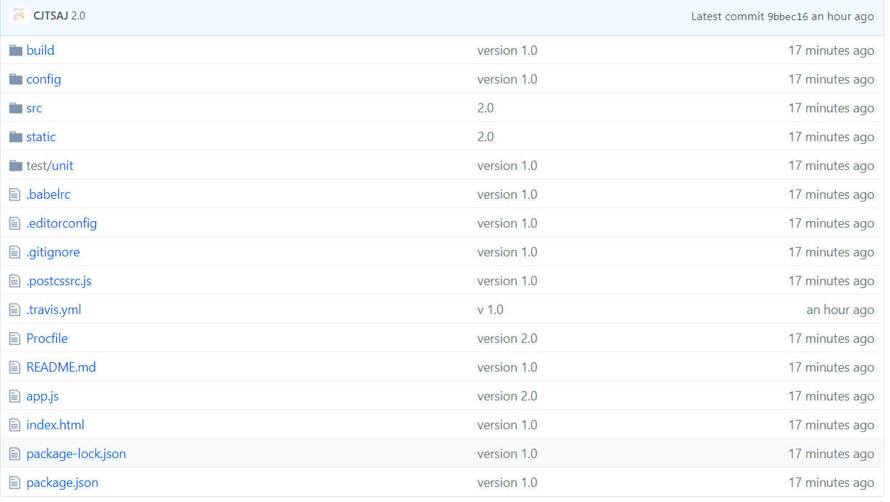
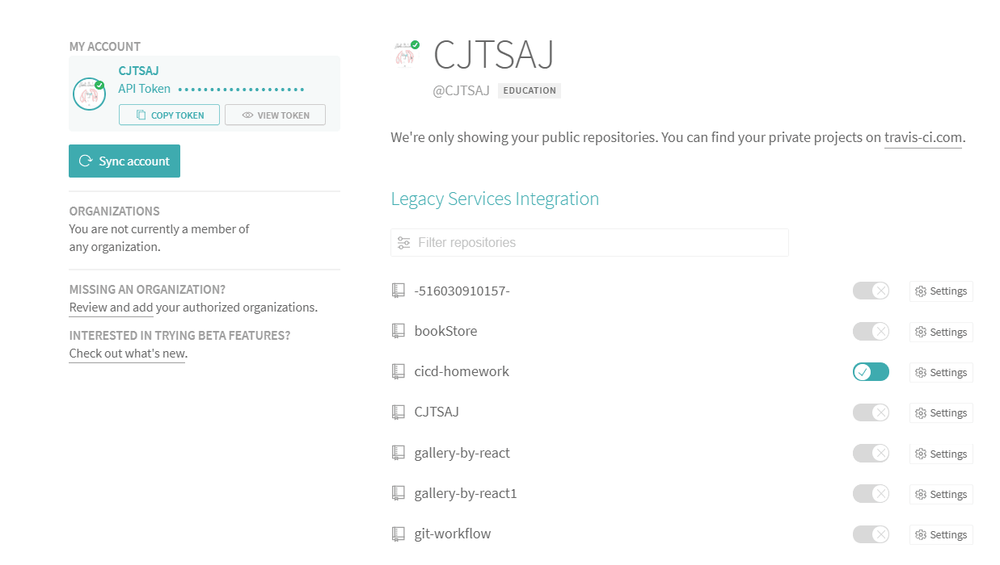
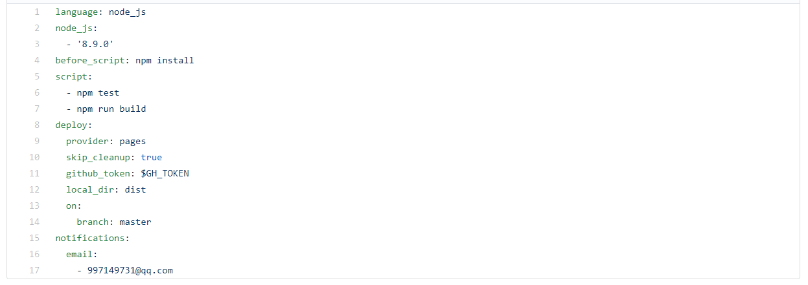

#travis实现CI/CD环境搭建与使用
##组员；陈江涛 方娄昊 刘泽宇 贾兴国 李琥

**Travis是一款持续集成（Continuous Integration)服务，它能很好地和Github结合，每当代码更新时自动地触发集成过程。本小组通过使用travis-ci和github page服务，搭建vue框架下的nodejs项目，用yaml格式配置，实现“提交代码->自动测试->自动部署"的集成链条。本期作业的前一个项目中，我们小组完成了travis+heroku的CI/CD手动部署，链接为[travis+heroku](https://github.com/CJTSAJ/cicd-homework)，本项目为CI/CD自动部署的实现，以下为具体实现过程。**
***
登陆github并创建一个项目

***

前往travis官网，使用github账号登陆，开启对travis-pages-homework项目的集成

***

在项目根目录中创建并简单配置.travis.yml文件，作用就是在代码提交的时候travis-ci会根据该配置文件执行配置的任务。在本小组配置中，与上个项目相同之处是：语言为node_js，在测试代码前运行npm install指令，测试代码时运行npm test指令，测试后的结果会发到邮箱。

***

与上个项目的yml文件不同之处在于，测试完后执行npm run build对本项目进行打包（用heroku时是在本地打包的），生成的dist静态文件被默认储存在gh-pages分支中，这在yml文件中的deploy代码段进行配置

***

为了配置deploy，我们在环境变量中新建了一个token使得travis对该项目有读写权限并引用它，local_dir目录设置为dist

***

上传.travis.yml文件后，自动测试、自动部署成功。可以点击以下链接进入[travis自动部署](https://cjtsaj.github.io/travis-pages-homework)

